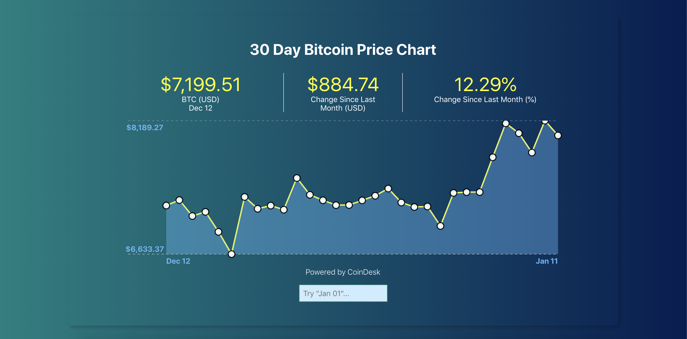

## 30 Day Bitcoin Price Chart

The objective of this exercise is to make a single web application with the following base requirements.

- a data-table showing the contents of the API calls.
- a query module with filters which enable the user the query a subset of the above datable.
- minimum of one graph visualization of the data represented in the data table (ensure that the data is graphable).

## Screenshots



## Tech/framework used

<b>Built with</b>

- [create-react-app](https://github.com/facebook/create-react-app)

<b>CrytoCurrency CoinDesk APIs</b>

- [CoinDesk](https://www.coindesk.com/coindesk-api)

## Features

- Single Web Application using AJAX & Fetch API
- Fetch Data using CoinDesk API
- Responsive
- Filter Search Functionality
- Graph Visualization
- Display Tooltip Info

## Setup

- Download Node.Js that includes npm on your OS of choice.

- Node allows us to run Javascript outside of the browser.

To run this project, install it locally using npm:

```
$ cd ../hone_capital_challenge
$ npm install
$ npm run start-dev
```

### `npm install`

Runs the installation to ensure that the dependencies remain the same on all machines the project is installed on.

### `npm run start-dev`

Runs the app in the development mode.<br>
Open [http://localhost:3000](http://localhost:3000) to view it in the browser.

The page will reload if you make edits.<br>
You will also see any lint errors in the console.
